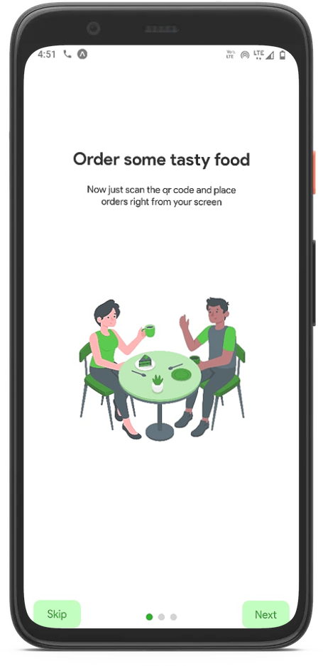
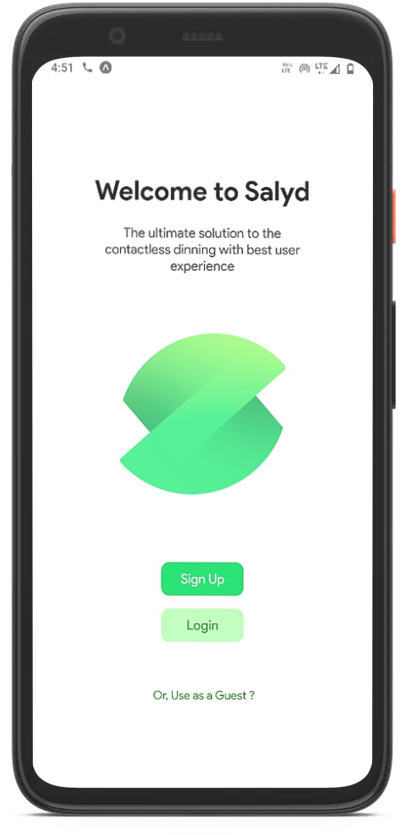
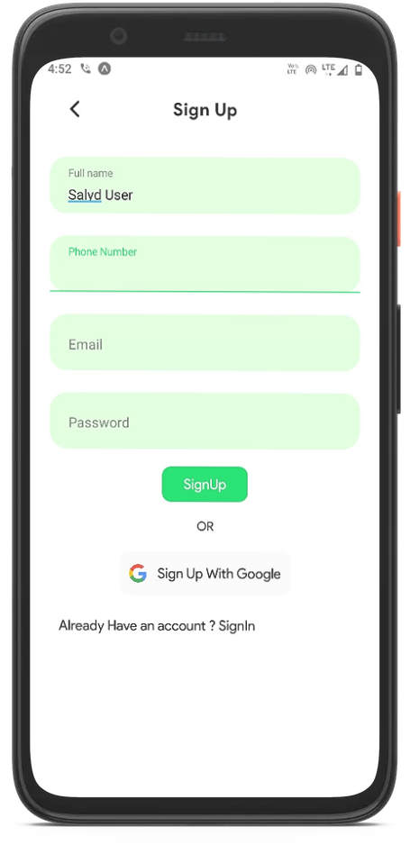
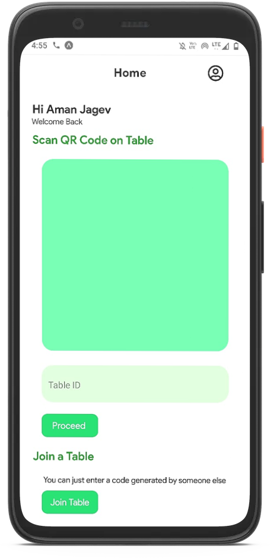
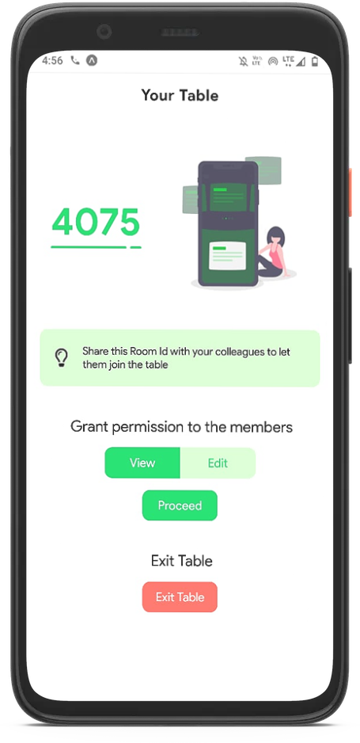
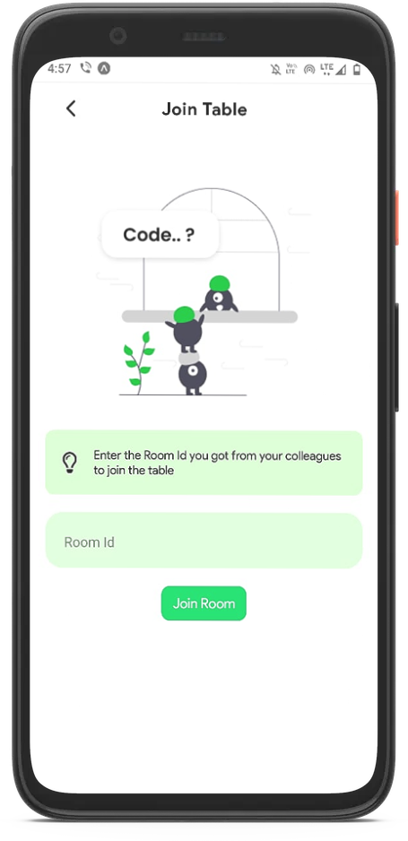
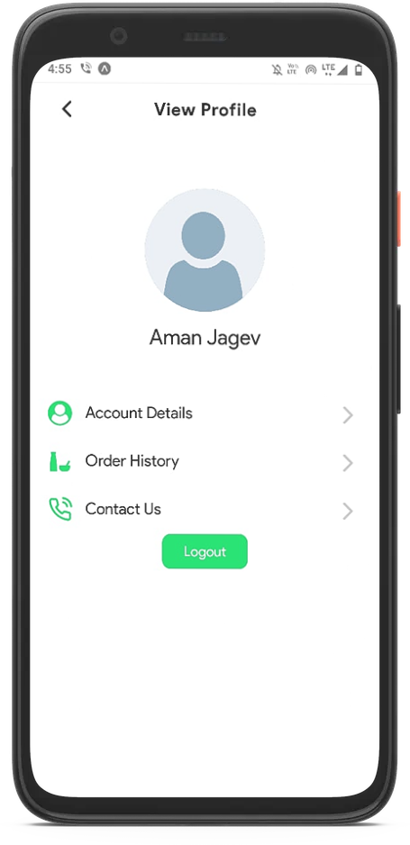
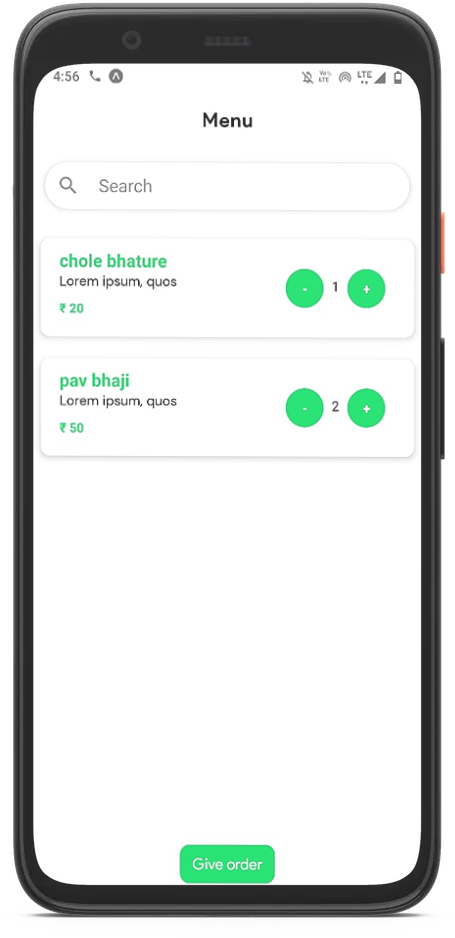
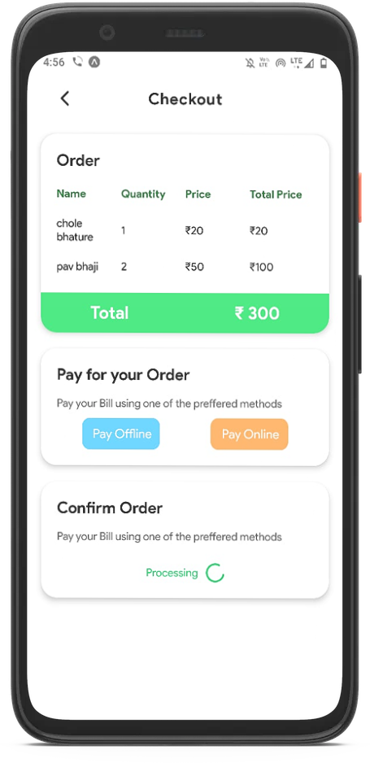

[](https://github.com/amanjagdev/salyd/graphs/contributors/)
[](https://github.com/amanjagdev/salyd/stargazers/)
[](https://github.com/amanjagdev/salyd/network/members/)
[](http://makeapullrequest.com)
[](http://perso.crans.org/besson/LICENSE.html)
<!-- [](https://github.com/amanjagdev/salyd/badges/) -->

<!-- PROJECT LOGO -->
<br />
<p align="center">
  <a href="https://github.com/amanjagdev/salyd">
    
  </a>

   <h1 align="center">Salyd </h1>

  <p align="center">
    Bringing flawless contactless dinning experience 
    <br />
    <br />
    ·
    <a href="https://github.com/amanjagdev/salyd/issues">Report Bug</a>
    ·
    <a href="https://github.com/amanjagdev/salyd/issues">Request Feature</a>
  </p>
</p>

<!-- TABLE OF CONTENTS -->

## Table of Contents

-   [About the Project](#about-the-project)
    -   [Built With](#built-with)
-   [Getting Started](#getting-started)
    -   [Prerequisites](#prerequisites)
    -   [Referenced Repositories](#referenced-repositories)
    -   [Installation](#installation)
-   [Usage](#usage)
-   [Roadmap](#roadmap)
-   [Contributing](#contributing)
-   [Contact](#contact)

<!-- ABOUT THE PROJECT -->

## About The Project

<!-- [![Product Name Screen Shot][product-screenshot]](https://example.com) -->

<p align ="center">




This project aims to bring a flawless contactless dinning experience, where the customers coming to the restaurant can scan the qr code and get the menu on their respective screens. 

### Here's what we provide to the customers

- Customers can scan the QR code placed on their respective table.
- They can join particular room as guest users by entering the unique Room Id.
- Admin of the table can grant members of the table different permissions like view only and edit.
- Customers can place and pay order in just few clicks.
- They can view recent orders history with the proper bill of the orders.

### Here's what we provide to the restaurants

- A Web portal for menu management to add/edit items according to the need from any platform.
- It also provides with the live order and payment status of respective table.
- Push notification on successful placement of order and payment of the order.

### Built With

<p float ="right">


</p>
<!-- GETTING STARTED -->

## Getting Started
To get a local copy up and for running the project locally, follow these simple steps.

### Prerequisites

Install node,npm & Expo

[Install npm](https://www.npmjs.com/get-npm)

[Install Expo](https://docs.expo.io/)

For implemnting Google OAuth , set up your own firebase config and place the file with name "firebase.js" in config folder at the root location.

[Refer this](https://firebase.google.com/docs/auth/web/google-signin)

### Referenced Repositories

[Salyd Server](https://github.com/kg-kartik/salyd-server)

[Salyd Restaurant](https://github.com/amanjagdev/salyd-restro)

### Installation

1. Clone the repo

```sh
git clone https://github.com/amanjagdev/salyd.git
```

3. Install Expo Cli if you haven't already

```sh
npm install -g expo-cli
```

3. Install packages

```sh
npm install
```

4. Build expo project and Run the bundler

```sh
expo start
```

<!-- USAGE EXAMPLES -->

## Usage

* Firstly, you will get option to either signup or login in the app.

<p align ="center">



* Signup in the app if you are not logged in. You can also signup using Google Oauth. 

<p align ="center">



* After that, you can scan the qr code or enter the tableId to join a particular table as an admin.


<p align ="center">




* On successful joinning of table, you will get a unique Room Id which can be shared with the other table members to let them join that particular table as guest. Admin can also set permission for other table members to either only view the menu or edit it.
 
<p align ="center">



* The other table members can join the table with that unique Room Id either by loginning in or as guest users.

<p align ="center">




* Logged in users can also view and edit profile.They can also view recent orders if any.

<p align ="center">



*Admin after successfully setting permission will be taken to menu screen where admin and all the table members can select menu items(depending upon permission) and proceed for placing the order.

<p align ="center">



* Here admin will get the description and price of the menu items. And then can proceed for payment by choosing either of the payment options mentioned.As soon as the payment is confirmed from restauarant side, order will be confirmed.

<p align ="center">



<!-- ROADMAP -->

## Roadmap

See the [open issues](https://github.com/amanjagdev/salyd/issues) for a list of proposed features (and known issues).

<!-- CONTRIBUTING -->

## Contributing

Contributions are what make the open source community such an amazing place to be learn, inspire, and create. Any contributions you make are **greatly appreciated**.

1. Fork the Project
2. Create your Feature Branch (`git checkout -b feature/AmazingFeature`)
3. Commit your Changes (`git commit -m 'Add some AmazingFeature'`)
4. Push to the Branch (`git push origin feature/AmazingFeature`)
5. Open a Pull Request

<!-- CONTACT -->

## Contact

<!-- <Names> -->

Aman Jagdev - [GitHub](https://github.com/amanjagdev) - amankumarjagdev@gmail.com

Kartik Goel - [GitHub](https://github.com/kg-kartik) - goel.kartik39@gmail.com

<p align = "center" >Made with :purple_heart: for :india: </p>

