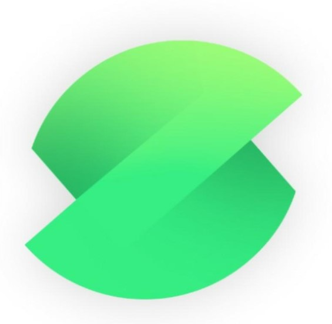

[](https://github.com/amanjagdev/salyd/graphs/contributors/)
[](https://github.com/amanjagdev/salyd/stargazers/)
[](https://github.com/amanjagdev/salyd/network/)
[](http://makeapullrequest.com)
[](http://perso.crans.org/besson/LICENSE.html)
[](https://github.com/amanjagdev/salyd/badges/)

<!-- PROJECT LOGO -->
<br />
<p align="center">
  <a href="https://github.com/amanjagdev/salyd">
    
  </a>

  <h3 align="center">Salyd</h3>

  <p align="center">
    Bringing flawless contactless dinning experience 
    <br />
    <a href="https://github.com/amanjagdev/salyd/issues">View Demo</a>
    ·
    <a href="https://github.com/amanjagdev/salyd/issues">Report Bug</a>
    ·
    <a href="https://github.com/amanjagdev/salyd/issues">Request Feature</a>
  </p>
</p>

<!-- TABLE OF CONTENTS -->

## Table of Contents

-   [About the Project](#about-the-project)
    -   [Built With](#built-with)
-   [Getting Started](#getting-started)
    -   [Prerequisites](#prerequisites)
    -   [Installation](#installation)
-   [Usage](#usage)
-   [Roadmap](#roadmap)
-   [Contributing](#contributing)
-   [License](#license)
-   [Contact](#contact)
-   [Acknowledgements](#acknowledgements)

<!-- ABOUT THE PROJECT -->

## About The Project

[![Product Name Screen Shot][product-screenshot]](https://example.com)


### Built With


<!-- GETTING STARTED -->

## Getting Started

To get a local copy up and running follow these simple steps.

### Prerequisites

Install node,npm & Expo

[Install npm](https://www.npmjs.com/get-npm)

[Install Expo](https://docs.expo.io/)

### Installation

1. Clone the repo

```sh
git clone https://github.com/amanjagdev/salyd.git
```

3. Install Expo Cli if you haven't already

```sh
npm install -g expo-cli
```

3. Install packages

```sh
npm install
```

4. Build expo project and Run the bundler

```sh
expo start
```

<!-- USAGE EXAMPLES -->

## Usage

Use this space to show useful examples of how a project can be used. Additional screenshots, code examples and demos work well in this space. You may also link to more resources.

_For more examples, please refer to the [Documentation](https://example.com)_

<!-- ROADMAP -->

## Roadmap

See the [open issues](https://github.com/amanjagdev/salyd/issues) for a list of proposed features (and known issues).

<!-- CONTRIBUTING -->

## Contributing

Contributions are what make the open source community such an amazing place to be learn, inspire, and create. Any contributions you make are **greatly appreciated**.

1. Fork the Project
2. Create your Feature Branch (`git checkout -b feature/AmazingFeature`)
3. Commit your Changes (`git commit -m 'Add some AmazingFeature'`)
4. Push to the Branch (`git push origin feature/AmazingFeature`)
5. Open a Pull Request

<!-- LICENSE -->

## License

Distributed under the MIT License. See `LICENSE` for more information.

<!-- CONTACT -->

## Contact

<!-- <Names> -->

Project Link: [https://github.com/amanjagdev/salyd](https://github.com/amanjagdev/salyd)

<!-- ACKNOWLEDGEMENTS -->

## Acknowledgements

-   []()
-   []()
-   []()
